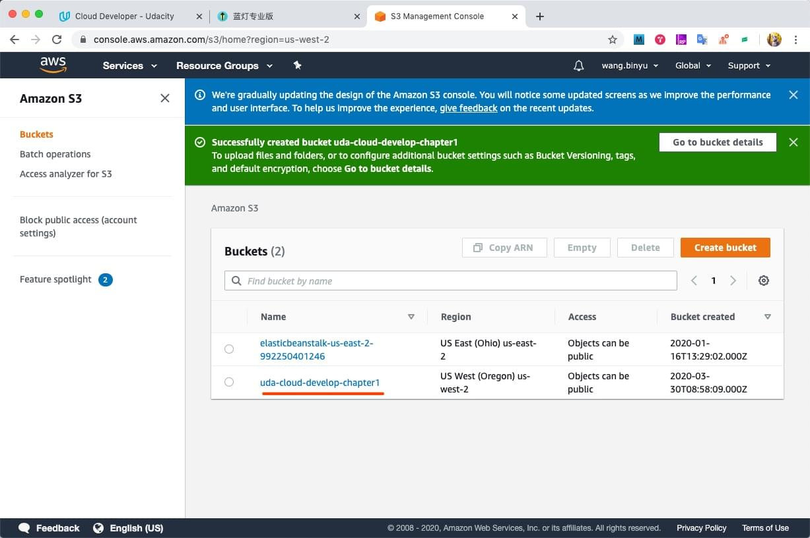
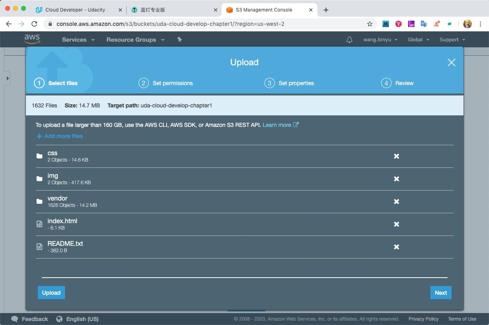
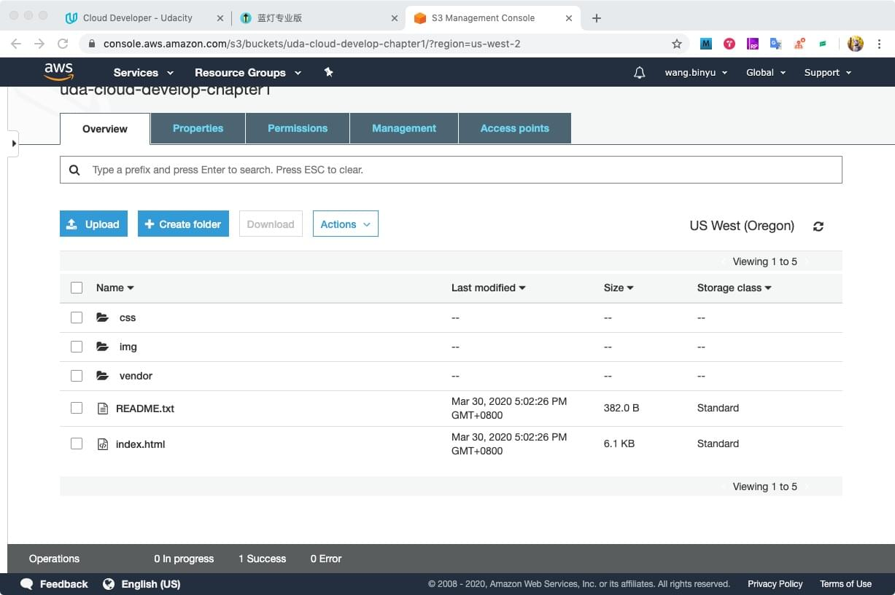
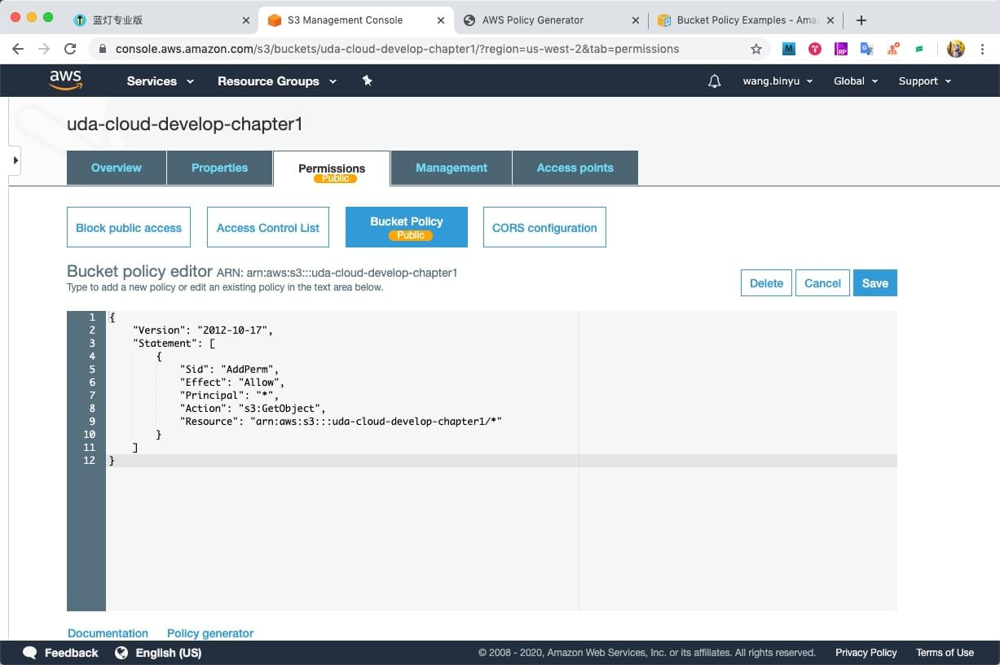
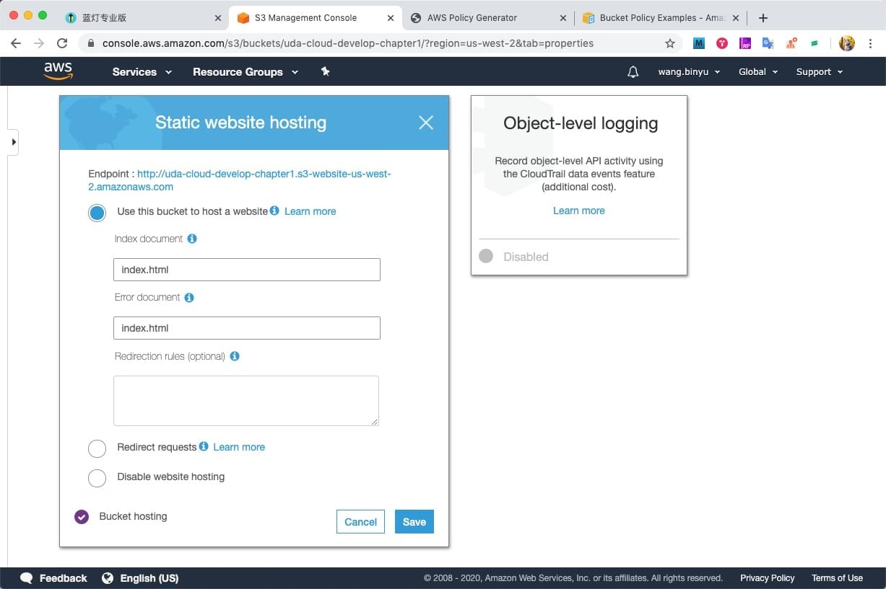
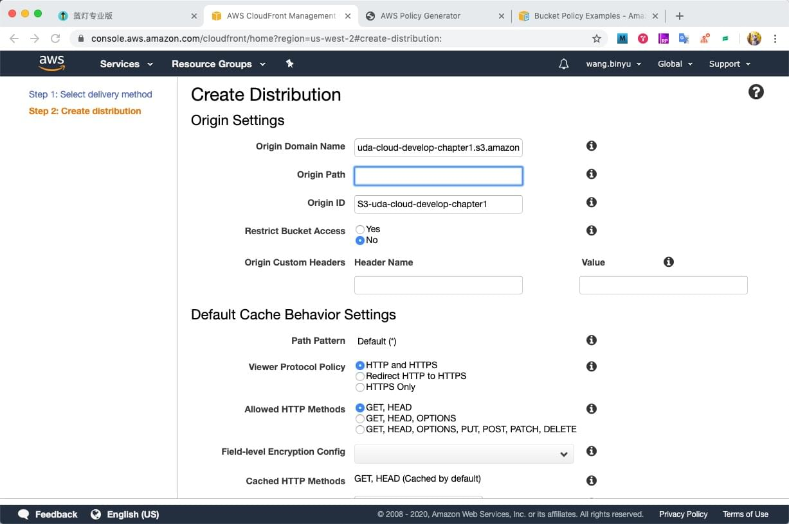
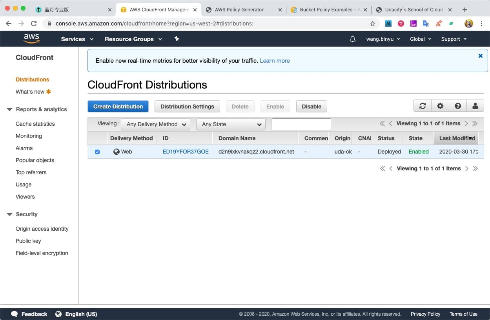
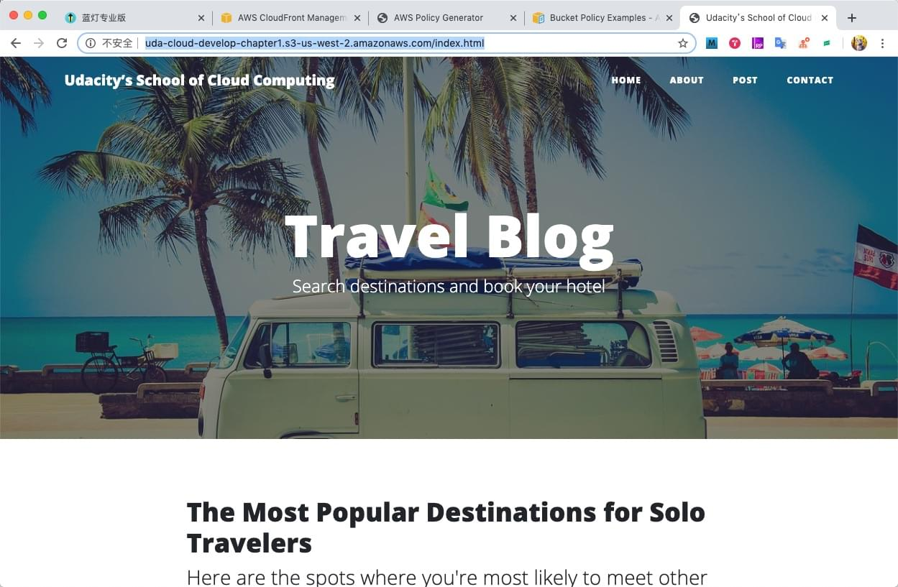

URL: http://uda-cloud-develop-chapter1.s3-us-west-2.amazonaws.com/index.html

- step 1: create a S3 Bucket. 
  - 
- step 2: update static resources to S3 Bucket instance. 
  - 
- step 3: uploaded. 
  - 
- step 4: set Bucket Policy of S3 Bucket's Permissions 
  - 
  - the version always be '2012-10-17' 
  - also got JSON from the link of Policy generator
- step 5: select Properties of Static website hosting 
  - 
- step 6: create a distribution of Cloud Front with S3 Bucket 
  - 
- step 7: wait the website deployed. 
  - 
- step 8: borswer the website with URL 
  - 