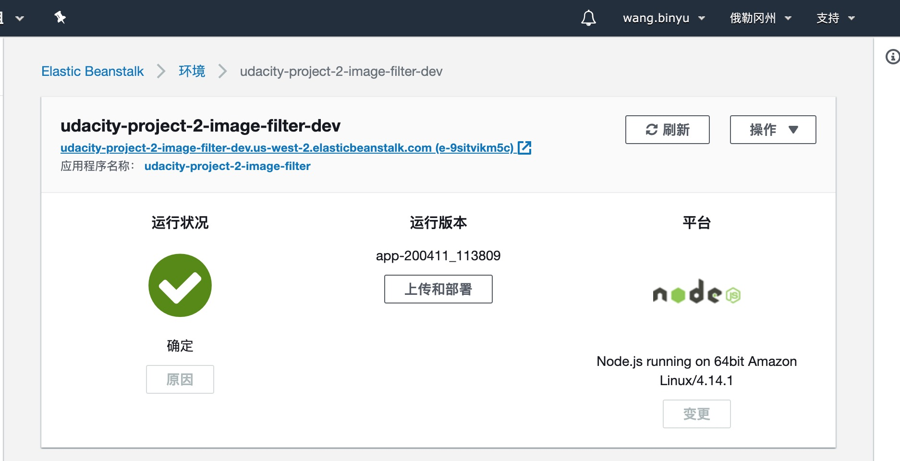

- step 1: develop the feature in the `server.ts`
- step 2: build project with `npm run build` and check the `www` folden.
- step 3: install EB CLI and initialize it.
- step 4: add one row `deploy: artifact: ./www/Archive.zip` to `.elasticbeanstalk/config.yml`
- step 5: create an application named `udacity-project-2` with `eb create`

1. host: <http://udacity-project-2-image-filter-dev.us-west-2.elasticbeanstalk.com>
2. endpoint: <http://udacity-project-2-image-filter-dev.us-west-2.elasticbeanstalk.com/filteredimage?image_url=https://cn.bing.com/th?id=OHR.LasMedulasMine_ZH-CN7176415270_UHD.jpg&pid=hp&w=3840&h=2160&rs=1&c=4&r=0>